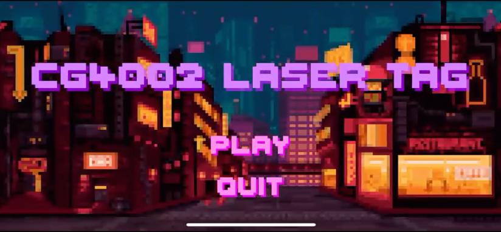
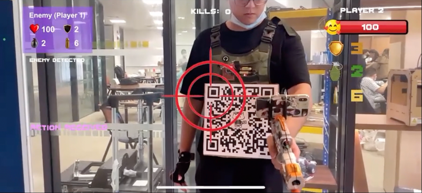

# Visualizer

[Here](https://youtu.be/xCFbp8YaT_I) is our video recording of visualizers for unseen players game.

## Instruction
 - Software Required: [Unity](https://unity.com/) 2021.3.11, or later version
 - Our visualizer project is built based on iOS platform. To switch the platform and settings: from Unity’s main menu, go to File > Build Settings.
 - To try out the project, you need to add the Vuforia Engine to your package folder. More information on how to set up Vuforia Engine is provided [here](https://developer.vuforia.com/).
